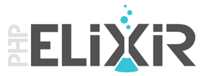

<h1 align="center">Framework PHP</h1>

### TODO LIST ###

- Add method "with" to model.
- Add methods "save", "add", "remove", etc. to collection relation in model.
- Create "migration" command.
- Add "menu" helper ("Tree" component).
- Add More Field type, themes, etc. in a "Form" module.
- Create "Admin" module.
- Add "@include" logic in "I18N", "Routing", "Security" components.
- Global refactorisation.
